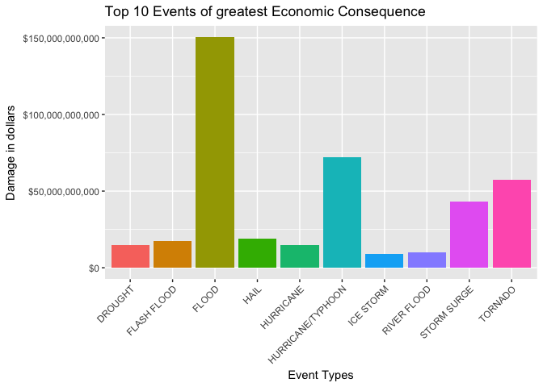
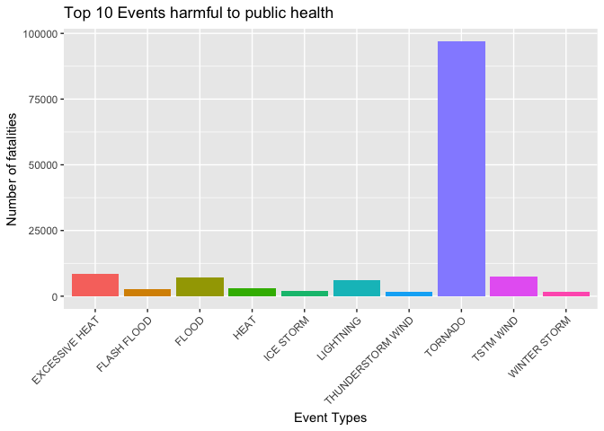
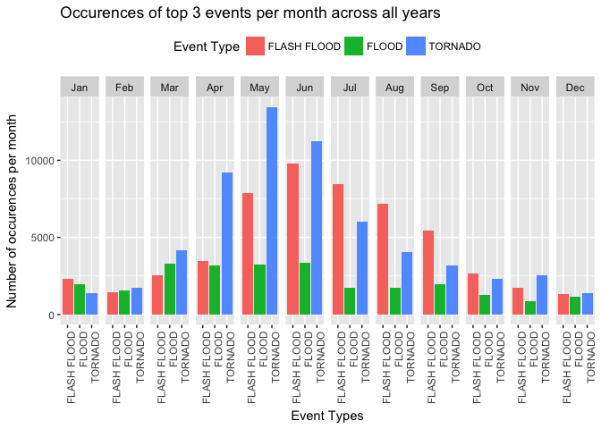

# Synopsis
This project involves exploring the U.S. National Oceanic and Atmospheric Administration's (NOAA) storm database. This database tracks characteristics of major storms and weather events in the United States, including when and where they occur, as well as estimates of any fatalities, injuries, and property damage.
The aim of the analysis is to bring forward the events which are most destructive in terms of economy and human life. 
This report will highlight the top ten weather events which are most significant in terms of economic loss and loss of human life. 
Further, this report zeroes in on three weather events which are highly destructive on both aspects (economic loss and human fatalities) and analyzes the spread of these three events across the months over the last sixty years.

# Data Processing

### Downloading the data from the Web

```r
path <- getwd()
url <- "https://d396qusza40orc.cloudfront.net/repdata%2Fdata%2FStormData.csv.bz2"
f <- "StormData.csv.bz2"
if (!file.exists(path)) {dir.create(path)}
download.file(url, file.path(path, f))
```

### Loading the downloaded data into the workspace
This will take some time

```r
NOAA <- read.csv("StormData.csv.bz2")
```

### Applying data transformations
1. Converting date columns into date format

```r
NOAA$BGN_DATE <- as.Date(NOAA$BGN_DATE, format = "%m/%d/%Y %H:%M:%S")
NOAA$END_DATE <- as.Date(NOAA$END_DATE, format = "%m/%d/%Y %H:%M:%S")
```
2. Lookout for same column values which are in different case (upper/lower/camelcase)

```r
unique(NOAA$TIME_ZONE)
```

```
##  [1] CST EST PST MST CDT PDT EDT UNK HST GMT MDT AST ADT CSt ESt CSC SCT
## [18] ESY UTC SST AKS GST
## 22 Levels: ADT AKS AST CDT CSC CST CSt EDT EST ESY ESt GMT GST HST ... UTC
```

```r
unique(NOAA$CROPDMGEXP)
```

```
## [1]   M K m B ? 0 k 2
## Levels:  0 2 ? B K M k m
```

```r
unique(NOAA$PROPDMGEXP)
```

```
##  [1] K M   B m + 0 5 6 ? 4 2 3 h 7 H - 1 8
## Levels:  + - 0 1 2 3 4 5 6 7 8 ? B H K M h m
```
3. Bring the data to uniform cases where they differ in case only (upper/lower/camelcase)

```r
NOAA$TIME_ZONE[NOAA$TIME_ZONE == "CSt"] <- "CST"
NOAA$TIME_ZONE[NOAA$TIME_ZONE == "ESt"] <- "EST"
NOAA$CROPDMGEXP[NOAA$CROPDMGEXP == "m"] <- "M"
NOAA$CROPDMGEXP[NOAA$CROPDMGEXP == "k"] <- "K"
NOAA$PROPDMGEXP[NOAA$PROPDMGEXP == "m"] <- "M"
```
4. Extract the Year & Month of the Begin Date variable

```r
require(lubridate)
NOAA$BGN_YEAR <- year(NOAA$BGN_DATE)
NOAA$BGN_MONTH <- month(NOAA$BGN_DATE,label = TRUE)
```
5. We need the data set where the Crop damage/Property damage has run into billions, millions or hundreds

```r
NOAA_sub <- NOAA[which(NOAA$PROPDMGEXP %in% c("B","M","K") 
                       | NOAA$CROPDMGEXP %in% c("B","M","K")),]
NOAA_sub$PROPDMG <- ifelse(NOAA_sub$PROPDMGEXP == "K",
                           as.numeric(1000*NOAA_sub$PROPDMG),NOAA_sub$PROPDMG)
NOAA_sub$CROPDMG <- ifelse(NOAA_sub$CROPDMGEXP == "K"
                           ,as.numeric(1000*NOAA_sub$CROPDMG),NOAA_sub$CROPDMG)
NOAA_sub$PROPDMG <- ifelse(NOAA_sub$PROPDMGEXP == "M",
                           as.numeric(1000000*NOAA_sub$PROPDMG),NOAA_sub$PROPDMG)
NOAA_sub$CROPDMG <- ifelse(NOAA_sub$CROPDMGEXP == "M", 
                           as.numeric(1000000*NOAA_sub$CROPDMG),NOAA_sub$CROPDMG)
NOAA_sub$PROPDMG <- ifelse(NOAA_sub$PROPDMGEXP == "B",
                           as.numeric(1000000000*NOAA_sub$PROPDMG),NOAA_sub$PROPDMG)
NOAA_sub$CROPDMG <- ifelse(NOAA_sub$CROPDMGEXP == "B", 
                           as.numeric(1000000000*NOAA_sub$CROPDMG),NOAA_sub$CROPDMG)
NOAA_sub$TOTALDMG <- as.numeric(NOAA_sub$PROPDMG + NOAA_sub$CROPDMG)
NOAA_sub$EVTYPE <- as.character(NOAA_sub$EVTYPE)
```

7. Now let's get the total economic damage per event type

```r
total.dmg.per.ev.type <- with(NOAA_sub,tapply(TOTALDMG,EVTYPE,sum,na.rm=T))
total.dmg.per.ev.type.df <- data.frame(EVTYPE = names(total.dmg.per.ev.type), 
                                       TOTALDMG = total.dmg.per.ev.type)
total.dmg.per.ev.type.df <- total.dmg.per.ev.type.df[order(total.dmg.per.ev.type.df$TOTALDMG),]
```
8. Also, we need the total health hazards per event type, i.e. fatalities & injuries

```r
NOAA$TOTALHLTHDMG <- as.numeric(NOAA$FATALITIES + NOAA$INJURIES)
total.fatal.per.ev.type <- with(NOAA, tapply(TOTALHLTHDMG,EVTYPE,sum,na.rm=T))
total.fatal.per.ev.type.df <- data.frame(EVTYPE = names(total.fatal.per.ev.type), TOTALHLTHDMG = total.fatal.per.ev.type)
total.fatal.per.ev.type.df <- total.fatal.per.ev.type.df[order(total.fatal.per.ev.type.df$TOTALHLTHDMG),]
```

# Results
### Top 10 event types in terms of greatest economic consequences

```r
require(scales)
require(ggplot2)

ggplot(tail(total.dmg.per.ev.type.df,10),aes(x=EVTYPE,y=TOTALDMG, fill = EVTYPE, label = dollar(TOTALDMG))) + geom_col() + scale_y_continuous(labels = dollar) + ggtitle("Top 10 Events of greatest Economic Consequence") + scale_size_area() + xlab("Event Types") + ylab("Damage in dollars") + theme(axis.text.x = element_text(angle = 45, hjust = 1), legend.position="none")
```

<!-- -->

From the figure above, FLOOD emerges as the most economically damaging weather event over the last sixty years, followed by HURRICANE/TYPHOON and TORNADO 

### Top 10 event types which are most harmful with respect to population health

```r
ggplot(tail(total.fatal.per.ev.type.df,10),aes(x=EVTYPE,y=TOTALHLTHDMG, fill = EVTYPE, label = TOTALHLTHDMG)) + geom_col() + ggtitle("Top 10 Events harmful to public health") + xlab("Event Types") + ylab("Number of fatalities") + theme(axis.text.x = element_text(angle = 45, hjust = 1), legend.position="none")
```

<!-- -->

From the figure above, TORNADO emerges as the most life threatning & injury causing weather event over the last sixty years, followed by FLOOD, TSTM WIND, LIGHTNING and EXCESSIVE HEAT

### Let's concentrate on the 3 events which are of maximum economic consequence as well as result in maximum fatalities & injuries (i.e. which appear in both the above top 10 lists)

1. First gather the total number of occurences of all event types per month across all years

```r
require(dplyr)
total.evtype.per.mon <- NOAA %>% group_by(EVTYPE,BGN_MONTH) %>% summarise(number = n())
total.evtype.per.mon <- total.evtype.per.mon[order(total.evtype.per.mon$number),]
total.evtype.per.mon <- as.data.frame(total.evtype.per.mon)
```

2. Filter out the data for the 3 events which are of maximum economic consequence as well as result in maximum fatalities (i.e. which appear in both the above top 10 lists)

```r
top.three.evnts <- total.evtype.per.mon[total.evtype.per.mon$EVTYPE %in% c("FLOOD","FLASH FLOOD","TORNADO"),]
top.three.evnts$EVTYPE <- as.character(top.three.evnts$EVTYPE)
top.three.evnts$EVTYPE <- as.factor(top.three.evnts$EVTYPE)
```

### Distribution of the above top 3 event types over all months 

```r
ggplot(top.three.evnts, aes(EVTYPE,number,fill = EVTYPE)) + geom_bar(stat = "identity") + facet_grid(.~BGN_MONTH) + theme(axis.text.x = element_text(angle = 90, hjust = 1), legend.position="top") + ggtitle("Occurences of top 3 events per month across all years") + xlab("Event Types") + ylab("Number of occurences per month") + scale_fill_discrete(name = "Event Type")
```

<!-- -->

The figure above shows that, occurences of all the top 3 event types (which causes most economic damage and public health hazards) tend to peak during the months of April, May, June and July.

# Conclusion
Based on the available NOAA data over the last sixty years, the weather events TORNADO, FLASH FLOOD and FLOOD causes both maximum economic damage and public health hazard. These three events are most frequently observed during the middle of the year, in the months of April, May, June and July.
